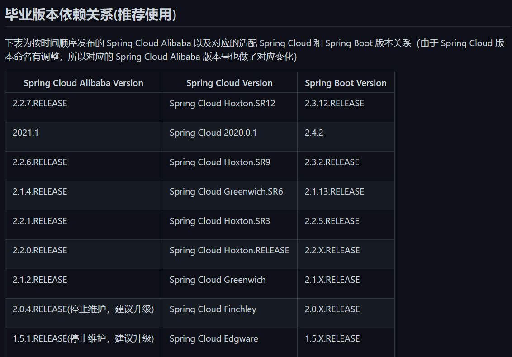
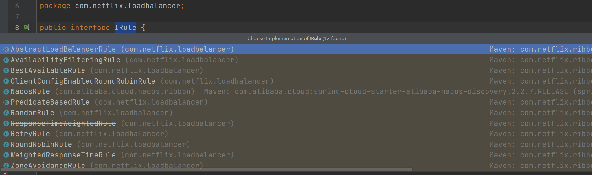

[TOC]

****

### 一、版本说明

1. #### 版本关系

   github查看：https://github.com/alibaba/spring-cloud-alibaba/wiki/%E7%89%88%E6%9C%AC%E8%AF%B4%E6%98%8E

   

   

   链接包含了项目所需依赖，只需在 `<dependencyManagement>` 中添加 Spring Cloud Alibaba 依赖即可：

   ```xml
   <dependency>
       <groupId>com.alibaba.cloud</groupId>
       <artifactId>spring-cloud-alibaba-dependencies</artifactId>
       <version>2.2.7.RELEASE</version>
       <type>pom</type>
       <scope>import</scope>
   </dependency>
   ```

    父项目添加依赖后，子项目自动继承依赖。

2. #### 项目创建

   * 阿里云脚手架：https://start.aliyun.com/
   * Spring脚手架：https://start.spring.io/


****

### 二、Nacos注册中心

1. #### 什么是Nacos

   集：==注册中心==、==配置中心==、==服务管理== 的平台。

   关键特性：

   * 服务发现和服务健康监测
   * 动态配置服务
   * 动态 DNS 服务
   * 服务及其元数据 (服务名称、地址、命名空间等) 管理

2. #### Nacos注册中心

    引入心跳机制，定时接收心跳信息，若没有按时接收到心跳 (默认5秒发送一次) ，则注册中心便会将status改为down；若15秒内还没有心跳，则不会再拉取该服务，同时服务健康状态变为false；再后达到一定时间 (默认30秒) 没有心跳，则直接剔除该服务。

3. #### 核心功能

   Nacos Discovery

   * **服务注册**：Nacos Client发送REST请求向Nacos Server注册服务；
   * **服务心跳**：注册后，会维护一个定时心跳，默认5秒一次；
   * **服务同步**：Nacos Server集群之间会互相同步服务实例；
   * **服务发现**：Nacos Client在调用服务时，会缓存Server中的服务清单到本地，并启动一个定时任务定时拉取最新服务清单来更新本地缓存；
   * **服务监控检查**：Nacos Server会开启一个定时任务检查注册服务的健康状态，15s未接收到心跳，健康状态将视为false，服务发现不会拉取；30s没有心跳，则直接剔除该服务实例。

4. #### Nacos Server部署（windows版本）

   *Nacos服务端下载* ：https://github.com/alibaba/nacos/releases/；自行选择合适的版本下载，源码等。

   *Nacos帮助文档* ：https://nacos.io/zh-cn/docs/what-is-nacos.html/

   * 配置启动方式为单机模式 (默认为集群方式)：
     * 编辑 `nacos/bin/startup.cmd` 文件，将 `set MODE="cluster"` 修改为 `set MODE="standalone"` 模式；
     * 配置Nacos服务，`nacos/conf/application.properties`  修改端口号、超时时间、最大连接数、数据源 等信息，默认存储位置是内存中，集群启动一般设置为MYSQL中；
     * 登录账户密码默认都是nacos；
   * **注意**：Nacos2.0.3版本对 JDK 的要求，如果启动失败，先更新 JDK 版本！此处使用的是1.8.0_311

5. #### Nacos Client服务

   1. 引入Nacos服务发现的依赖，版本由父工程提供：

      ```xml
      <dependency>
          <groupId>com.alibaba.cloud</groupId>
          <artifactId>spring-cloud-starter-alibaba-nacos-discovery</artifactId>
      </dependency>
      ```

   2. yml配置：
   
      ```yml
      # 应用服务 WEB 访问端口
      server:
        port: 8080
      # 应用名称
      spring:
        application:
          name: order-service   # 注册 Nacos Server将采用应用名称
        cloud:
          nacos:
            server-addr: 127.0.0.1:8848 # 注册地址
            discovery:
              username: nacos   # Nacos Server登录账户、密码、命名空间(自定义 dev / product)
              password: nacos
              namespace: public
              ephemeral: false	# 默认true，切换临时/永久，永久实例宕机后注册中心不会删除服务
      ```
   
   3. 如果使用 `RestTemplate` 模板类调用接口，需要配置如下：
   
      ```java
      @Configuration
      public class RestTemplateConfig {
          @Bean
          @LoadBalanced		//此处一定要配置负载均衡注解，Nacos不知道调用哪个服务
          public RestTemplate getRestTemplate(RestTemplateBuilder builder) {
              RestTemplate restTemplate = builder.build();
              return restTemplate;
          }
      }
      ```
   
   4. 启动类注解：`@EnableDiscoveryClient`，可加可不加，高版本的SpringCloud做了处理；
   
   5. 代码参考
   
      * order-service代码，服务调用者：
   
      ```java
      @RestController
      @RequestMapping("/order")
      public class OrderController {
      
          @Autowired
          private RestTemplate restTemplate;
      
          @RequestMapping("/getOrder")
          public String getOrder(){
              String info =
                      restTemplate.getForObject("http://stock-service/stock/getStock", String.class);
              return "HELLO WORLD!" + info;
          }
      }
      ```
   
      * stock-service代码，服务提供者，此处复制启动类端口8082测试负载均衡，默认轮询：
   
      ```java
      @RestController
      @RequestMapping("/stock")
      public class StockController {
      
          @Value("${server.port}")
          private String port;
      
          @RequestMapping("/getStock")
          public String getStock(){
              return "下单了！" + port;
          }
      }
      ```
   
6. #### Nacos Server配置项详解：

    * ==命名空间==：namespace，可创建多个命名空间，区分不同的项目或项目组等；

      

    * ==服务管理== ：

      

      (1) 服务列表：

      * **保护阈值**：取值范围0~1，0表示不开启；当 `健康实例 / 总实例数 < 阈值` 时，服务会将不健康的服务拿去使用，防止雪崩；

      * **临时实例**：ephemeral，默认true，切换临时/永久，永久实例宕机后注册中心不会删除服务，结合保护阈值使用；

      * **权重**：weight，结合负载均衡策略使用，越大则调用的次数越多；

      * **分组**：group，默认值“DEFAULT_GROUP”，比命名空间更细致的划分；

      * **元数据**：metadata，键值对类型的值，用于扩展功能；

        

      (2) 订阅者列表：

      ​	用于查询哪个服务被调用，调用者名称等信息；

    * ==权限管理==：配置登录Nacos的账户、密码、访问权限等信息；

    * ==配置管理==：统一配置服务的配置项，类似Spring Cloud Config的功能；

    * ==集群管理==：Nacos集群的配置；

7. #### Nacos集群搭建：

    环境：JDK1.8+，Maven3.3+，Nginx，MYSQL5.7+；

    参考文档：https://nacos.io/zh-cn/docs/cluster-mode-quick-start.html

    1. 复制三个节点，分别安装Nacos，搭建伪集群测试；

    2. 修改配置文件 application.propprties，配置数据源，MYSQL5.7+；

    3. 修改配置文件cluster.conf.example，改为cluster.conf，内部配置集群的 IP 地址：
    
       ```sh
       # ip:port
       192.168.2.100:8849
       192.168.2.101:8850
   192.168.2.102:8851 
      ```

    4. 数据库运行Nacos的sql脚本，创建数据库；

    5. 修改启动脚本 startup.sh：
   
   * 启动方式为集群：`set MODE="cluster"` 
       * 内存不足时 (此处虚拟机内存较小) ，修改小一些： `JAVA_OPT="${JAVA_OPT} -server -Xms512m -Xmx512m -Xmn256m -XX:MetaspaceSize=64m -XX:MaxMetaspaceSize=128m"`

    6. 官方推荐，nginx作为反向代理：

       * 配置 nginx.conf 配置文件：
   
         ```shell
         upstream nacoscluster { 
             server 192.168.2.100:8849;
             server 192.168.2.101:8850;
             server 192.168.2.102:8851;
         }	
         server { 
             listen 8848;
             server_name localhost;
             location /nacos/ {
             	# 反向代理的路径，如访问http://192.168.2.100:8848将均衡代理到对应的Nacos上
             	proxy_pass http://nacoscluster/naocs/;
             }
       }
         ```


****

### 三、Ribbon负载均衡

***Spring Cloud Ribbon***是基于**Netflix Ribbon**实现的一套客户端负载均衡工具，它通过**Load Balance**获取到服务端的所有机器实例，基于某种规则去调用这些服务，同时也可以实现我们自己的负载均衡算法。

1. #### 主流的负载方案：

   * 集中式负载均衡 (服务端)，硬件 / 软件的方式，如Nginx；
   * 客户端负载均衡，根据自身请求的状况做负载均衡；

2. #### 常见的负载均衡算法，实现接口==**IRule**==：

   

   * 随机

   * 轮询

   * 加权轮询

   * 地址Hash算法

   * 最小连接数

     ……

3. #### Nacos使用Ribobn

   1. 依赖问题；`nacos-discovery` 中添加了Ribbon的依赖，所以无需在添加！
   2. 添加注解：`@LoadBalanced` 加在==RestTemplate==配置类中；
   3. ==RestTemplate==调用的 url 地址，将 IP 改为对应的服务名称；

4. #### 自定义负载算法：

   1. 自定义配置类，可自己实现AbstractLoadBalancerRule抽象类，重写choose方法，使用getLoadBalancer方法获取所有的服务，按需返回指定的服务，即可实现自己需要的负载策略：

      ```java
      @Bean
      public IRule getIRule() {
          return new NacosRule();
      }
      ```

      **注意**：==此处的配置类不能放在启动类可扫描到的包下，否则会被所有服务共享策略！！！==

   2. 启动类配置注解，针对某一服务进行负载均衡策略：

      ```java
      @SpringBootApplication
      @RibbonClients(value = {
          @RibbonClient(name = "order-service", configuration = RestTemplateConfig.class),
          @RibbonClient(name = "stock-service", configuration = RestTemplateConfig.class)
      })
      public class OrderNacosApplication {
      
          public static void main(String[] args) {
              SpringApplication.run(OrderNacosApplication.class, args);
          }
      
      }
      ```

5. #### 自定义配置文件修改负载策略：

   采用NacosRule，它实现了Nacos的权重，可以在Nacos中配置，也可以在配置文件中配置weight，设置为0表示不使用此服务。

   ```yml
   # 基于配置文件形式的 针对单个服务的 Ribbon 负载均衡策略
   stock-service:  # 被调用者的服务名称
     ribbon:
       NFLoadBalancerRuleClassName: com.alibaba.cloud.nacos.ribbon.NacosRule
   ```

6. #### Ribbon饥饿加载：

   默认关闭，开启后，服务将在启动时初始化负载策略，解决服务初次访问速度响应慢的问题；

   ```yml
   ribbon:
     eager-load:
       enabled: true	# 开启饥饿加载
       # 指定需要饥饿加载的服务名称，多个服务使用逗号分隔
       clients: stock-service, order-service
   ```

7. #### Load Balancer替换Ribbon

   支持RestTemplate、WebClient两种方式；

   1. 添加SpringCloud父依赖：
   
      ```xml
      <!--父工程添加如下依赖-->
      <dependencyManagement>
          <dependency>
              <groupId>org.springframework.cloud</groupId>
              <artifactId>spring-cloud-dependencies</artifactId>
              <version>${spring-cloud.version}</version>
              <type>pom</type>
              <scope>import</scope>
          </dependency>
      </dependencyManagement>
      ```
   
   2. nacos-discovery依赖，排除掉Ribbon，子项目添加Load Balancer依赖：
   
      ```xml
   <dependency>
          <groupId>com.alibaba.cloud</groupId>
       <artifactId>spring-cloud-starter-alibaba-nacos-discovery</artifactId>
          <exclusions>
              <exclusion>
                  <!--排除Ribbon依赖-->
                  <groupId>org.springframework.cloud</groupId>
                  <artifactId>spring-cloud-starter-netflix-ribbon</artifactId>
              </exclusion>
          </exclusions>
   </dependency>
      <!--添加loadbalancer依赖-->
      <dependency>
          <groupId>org.springframework.cloud</groupId>
          <artifactId>spring-cloud-starter-loadbalancer</artifactId>
      </dependency>
      ```
   
   3. yml文件禁用Ribbon功能：
   
      ```yml
      spring:
        cloud:
          loadbalancer:
            ribbon:
              enabled: false
      ```
   
   4. 启动类配置，类似 `@RibbonClients` 的用法：
   
      ```java
      @LoadBalancerClients(value = {
          @LoadBalancerClient(name = "order-service", configuration = RestTemplateConfig.class),
          @LoadBalancerClient(name = "stock-service", configuration = RestTemplateConfig.class)
      })
      ```
   
   5. 自定义负载策略，实现 ==ReactorLoadBalancer== 接口，重写choose方法，实现自己的负载策略。


****

### 四、微服务调用组件Feign

*Feign* 是Netflix开发的声明式、模板化的HTTP**客户端**。可以更发方便简洁的调用HTTP API。

**SpringCloud Openfeign** 对Feign 进行了增强，使其支持SpringMVC注解，而且还整合了Ribbon和Nacos。

1. #### 使用OpenFeign

   1. 添加父依赖：spring-cloud-dependencies

   2. 添加openfeign依赖：

      ```xml
      <dependency>
          <groupId>org.springframework.cloud</groupId>
          <artifactId>spring-cloud-starter-openfeign</artifactId>
      </dependency>
      ```

   3. 服务调用者编写Feign接口，这里需要保证服务提供者服务存在Nacos中：

      ```java
      /**
       * name:需要调用的服务名称
       * path:也可以去掉，去使用@RequestMapping("/stock")
       */
      @FeignClient(name = "stock-service", path = "/stock")
      public interface StockFeignService {
          @RequestMapping("/getStock")
          String getStock();
      }
      ```

   4. 启动类开启Feign功能：==@EnableFeignClients==

2. #### Feign的自定义配置

   1. ##### 日志配置

      * 自定义配置类，配置日志级别：

        ```java
        @Configuration
        public class FeignConfig {
            @Bean
            public Logger.Level feignLoggerLevel() {
                return Logger.Level.FULL;	// 选择一种配置
             // return Logger.Level.BASIC;
             // return Logger.Level.HEADERS;
             // return Logger.Level.NONE;
            }
        }
        ```

      * yml配置文件修改Spring默认日志级别，改为只打印Feign的日志：

        ```yml
        # Spring的日志级别是info，而feign的日志级别是debug，不改这里就不会输出feign日志
        logging:
          level:
          	# 只输出指定的Feign接口日志信息
            com.axin.feign.StockFeignService: debug
        ```

      * ==局部日志配置==：

        * 第一种，将配置类的 `@Configuration` 去除，而在 `@FeignClient` 注解上配置属性：

          ```java
          @FeignClient(name = "stock-service", configuration = FeignConfig.class)
          public interface StockFeignService {
              @RequestMapping("/getStock")
              String getStock();
          }
          ```

        * 第二种，修改yml配置文件：

          ```yml
          feign:
            client:
              config:
                stock-service:  # 日志的服务名称
                  loggerLevel: BASIC
          ```

   2. ##### 契约配置

      原生Feign是不支持SpringMVC注解的，所以修改契约配置可以去使用原生的Feign注解，如老项目升级。

      修改配置后，Feign接口将不能使用MVC注解，而是使用原生注解。

      * 配置类修改契约配置：

        ```java
        @Bean
        public Contract feignContract() {
            return new Contract.Default();
        }
        ```

      * 配置文件yml修改：

        ```yml
        feign:
          client:
            config:
              stock-service:  # 服务名称
                contract: feign.Contract.Default  # 契约配置，还原原生注解
        ```

      * 原生注解对应MVC注解：

        `@RequestMapping("/getStock")` ==> `@RequestLine("GET /getStock")` 手动配置请求方法；

        `@PathVariable` ==> `@Param`

   3. ##### 超时时间配置

      * 全局配置类配置：

        ```java
        @Bean
        public Request.Options options() {
            return new Request.Options(5000, 10000);
        }
        ```

      * 配置文件yml配置：

        ```yml
        feign:
          client:
            config:
              stock-service:  # 服务名称
                connectTimeout: 5000    # 连接超时的时间，默认2s
                readTimeout: 10000      # 响应超时的时间，默认5s
        ```

   4. ##### 自定义拦截器实现认证

      * 配置类配置，自定义拦截器，实现**RequestInterceptor**接口，重写apply方法，加入Spring容器内；

      * 配置文件yml配置，这里拦截器就无需加入Spring容器了：

        ```yml
        feign:
          client:
            config:
              stock-service:  # 服务名称
                requestInterceptors[0]: # 配置拦截器
                  com.it.config.FeignAuthRequestInterceptor   # 自定义拦截器全路径
        ```


****

### 五、Nacos配置中心

1. #### 新增Nacos Config配置文件

   1. Nacos服务端新增配置：

      **注：微服务将自动读取Nacos中与微服务名称一样的配置文件名！！！**

      

   2. 启用Nacos的权限控制，`nacos/conf/application.properties`  中修改配置文件：

      **权限控制开启后，微服务中必须配置Nacos的用户名和密码，否则报错！！！**

      ```properties
      ### If turn on auth system:
      nacos.core.auth.enabled=true	# 默认false
      ```

2. #### 搭建Nacos Config的服务读取配置文件

   1. 添加依赖：

      ```xml
      <dependency>
          <groupId>com.alibaba.cloud</groupId>
          <artifactId>spring-cloud-starter-alibaba-nacos-config</artifactId>
      </dependency>
      ```

   2. 配置bootstrap.yml文件，此处没有开启权限控制，无需配置Nacos的用户名和密码：

      ```YML
      spring:
        application:
          name: config-service
        cloud:
          nacos:
            server-addr: 127.0.0.1:8848
      ```

   3. 测试读取配置信息：

      ```java
      @SpringBootApplication
      public class ConfigNacosApplication {
      
          public static void main(String[] args) {
              ConfigurableApplicationContext applicationContext = 
                  	SpringApplication.run(ConfigNacosApplication.class, args);
              ConfigurableEnvironment environment = 
                  	applicationContext.getEnvironment();
              System.out.println("my.name:" + 
                                 environment.getProperty("my.name"));
              System.out.println("my.password:" + 
                                 environment.getProperty("my.password"));
          }
      
      }
      ```

      

   4. 测试实时修改Naocs配置中心的配置，微服务将自动拉取新的信息；

   5. 修改微服务配置的文件格式，默认的格式为**properties**：

      ```yml
      spring:
        cloud:
          nacos:
            config:
              file-extension: yaml
      ```

   6. 配置profiles

      * Nacos配置中心的配置

        dataid的命名：==服务名 - 环境 - 文件后缀==，如config-nacos-dev.yml；

        **注意**：默认的配置文件(与服务名相同的dataid的配置文件)，则无需添加文件后缀。

      * 本地微服务的配置

        application.yml中，使用 `spring.profiles.active` 选择 dev / product 环境。

      * **配置文件的优先级**：

        ==profiles > 默认 > 自定义dataid配置==，优先级大的将覆盖小的，同时配置将互补，配置一项即可。

   7. 配置命名空间namespace，微服务配置后，将读取指定命名空间中的配置信息。

   8. 配置组group，微服务配置后，将读取指定组内的配置信息。

   9. 自定义dataid配置文件的读取：

      共两种方式，二者功能一致，只是优先级不同。

      ==extension-configs  >  shared-configs==，同时，数组的下标越大优先级越大。

      * shared-configs数组：

        **注意**：SpringBoot 将优先使用最后读取的配置文件，此处将选择下标1的配置。

        ```yml
        spring:
          cloud:
            nacos:
              server-addr: 127.0.0.1:8848
              config:
                file-extension: yaml
                shared-configs:   # 接收一个数组
                  - data-id: my.config1.yml	# 下标为0
                    refresh: true
                  - data-id: my.config2.yml	# 下标为1，SpringBoot优先使用后读取的配置
                    refresh: true
        ```

      * extension-configs数组：

        ```yml
        spring:
          cloud:
            nacos:
              server-addr: 127.0.0.1:8848
              config:
                file-extension: yaml
                extension-configs:   # 接收一个数组
                  - data-id: my.config3.yml   # 下标为0
                      refresh: true
                  - data-id: my.config4.yml   # 下标为1
                    refresh: true
        ```

   10. java类中动态获取配置信息：

       **注意**：正常情况下，修改配置中心的配置后，类中是无法动态取到的，需要添加注解 `@RefreshScope`：

       ```JAVA
       @RefreshScope
       @RestController
       @RequestMapping("/config")
       public class ConfigController {
           
           @Value("${my.name}")
           private String name;
           @Value("${my.password}")
           private String password;
           
           @RequestMapping("/show")
           public String show(){
               return this.toString();
           }
       
           @Override
           public String toString() {
               return "ConfigController{" +
                       "name='" + name + '\'' +
                       ", password='" + password + '\'' +
                       '}';
           }
       }
       ```


********

### 六、Sentinel分布式高可用组件

1. **说明文档**：https://github.com/alibaba/Sentinel

Sentinel 是面向分布式服务架构的流量控制组件，主要以**流量**为切入点，从限流、流量整形、熔断降级、系统负载保护、热点防护等多个维度来保障微服务的稳定性。

**Sentinel的特征：**

* 丰富的应用场景：
* 完备的实时监控：
* 广泛的开源生态：
* 完善的SPI扩展点：

**Sentinel和hystrix对比：**


1. #### 快速开始：

   1. 核心依赖：

      ```xml
      <dependency>
          <groupId>com.alibaba.csp</groupId>
          <artifactId>sentinel-core</artifactId>
          <version>1.8.4</version>
      </dependency>
      ```

   2. 其他依赖：

      ```xml
      <dependency>
          <groupId>org.springframework.boot</groupId>
          <artifactId>spring-boot-starter-web</artifactId>
      </dependency>
      ```

   3. 自定义一个Controller：

      ```java
      import com.alibaba.csp.sentinel.Entry;
      import com.alibaba.csp.sentinel.SphU;
      import com.alibaba.csp.sentinel.slots.block.BlockException;
      import org.springframework.web.bind.annotation.RequestMapping;
      import org.springframework.web.bind.annotation.RestController;
      
      @RestController
      public class HelloWorldController {
      
          @RequestMapping("/hello")
          public String helloWorld() {
              Entry entry = null;
              try {
                  entry = SphU.entry("hello");
                  return "hello world";
              }catch (BlockException be) {
                  return "限流了";
              } catch (Exception e) {
                  e.printStackTrace();
                  return "error";
              } finally {
                  if (entry != null) {
                      entry.exit();
                  }
              }
          }
      
      }
      ```
      
   4. 自定义一个Spring的初始化方法，内部添加限流规则：
   
      ```java
      import com.alibaba.csp.sentinel.slots.block.RuleConstant;
      import com.alibaba.csp.sentinel.slots.block.flow.FlowRule;
      import com.alibaba.csp.sentinel.slots.block.flow.FlowRuleManager;
      import org.springframework.context.annotation.Configuration;
      
      import javax.annotation.PostConstruct;
      import java.util.ArrayList;
      
      @Configuration
      public class SpringInitConfig {
      
          @PostConstruct  // 初始化方法, 类加载的时候执行, 在这里添加限流规则, 也可在启动类中添加
          private static void initFlowRule() {
              ArrayList<FlowRule> flowRules = new ArrayList<>();
              FlowRule rule = new FlowRule(); // 创建限流规则
              rule.setResource("hello");  //资源名称，可以是类名、方法名、路径名等
              rule.setGrade(RuleConstant.FLOW_GRADE_QPS); //限流等级
              rule.setCount(1);   // 限流阈值, 即每秒钟最多访问1次, 参数类型为double
              flowRules.add(rule);
              // 注册限流规则
              FlowRuleManager.loadRules(flowRules);   // 加载限流规则
          }
      }
      ```
   
      
   
   5. 端口号配置：
   
      ```yml
      server:
      	port: 8080
      ```
   
      
   
   6. 启动项目，浏览器访问：http://localhost:8080/hello
   
   7. ==缺点==：代码复杂，嵌入代码过多
   
2. #### @SentinelResource的使用

   1. 文档：https://github.com/alibaba/Sentinel/wiki/%E6%B3%A8%E8%A7%A3%E6%94%AF%E6%8C%81

   2. 添加依赖
   
      ```xml
      <dependency>
          <groupId>com.alibaba.csp</groupId>
          <artifactId>sentinel-annotation-aspectj</artifactId>
          <version>1.8.4</version>
   </dependency>
      ```

   3. 配置==SentinelResourceAspect==切面类，加入到Spring容器中：
   
      ```java
      /**
       * 配置SentinelResourceAspect, 会自动拦截@SentinelResource注解的方法
       */
      @Bean
      public SentinelResourceAspect sentinelResourceAspect() {
          return new SentinelResourceAspect();
   }
      ```

   4. 处理器方法上添加注解==@SentinelResource==：
   
      ```java
      @SentinelResource(
              value = "user",
              blockHandler = "userBlockHandler",
              fallback = "userFallback",
              exceptionsToIgnore = {NullPointerException.class}
      )
      @RequestMapping("/user")
      public User getUser(@RequestParam(required = false, value = "num") String num) {
          if (num != null) {
              throw new RuntimeException("降级了");
          } 
          return new User("张三", "23");
      }
      
      public User userBlockHandler(String num, BlockException e) {
          e.printStackTrace();
          return new User("限流了", "0");
      }
      
      public User userFallback(String num, Throwable e) {
          e.printStackTrace();
          return new User("降级了", "0");
   }
      ```

   5. 在Spring的初始化方法中，内部添加限流规则：
   
      ```java
      @PostConstruct  // 初始化方法, 在类加载的时候执行
      private static void initFlowRule() {
          ArrayList<FlowRule> flowRules = new ArrayList<>();
          FlowRule rule2 = new FlowRule(); // 创建限流规则（流量的控制）, 可以添加多个
          rule2.setResource("user");  //资源名称，可以是类名、方法名、路径名等，具体参考官方文档
          rule2.setGrade(RuleConstant.FLOW_GRADE_QPS);
          rule2.setCount(1);   // 限流阈值, 即每秒钟最多访问1次, 参数类型为double
          flowRules.add(rule2);
          // 注册限流规则
          FlowRuleManager.loadRules(flowRules);   // 加载限流规则
   }
      ```

   6. **@SentinelResource的常用属性**：

      * ***value***：资源名称，可以是类名、方法名、路径名等
   
      * ***blockHandler***：限流时执行的方法，返回值类型与原返回值类型一致，参数可以新增BlockException
   
      * ***blockHandlerClass***：限流时执行方法存在的类，使用*blockHandler*指定对应的方法，需要使用static修饰
   
      * ***fallback***：降级处理器，用于接收异常，当资源被降级时，会调用该处理器，返回值类型与原返回值类型一致，参数可以新增Throwable
   
      * ***fallbackClass***：降级时执行方法存在的类，使用*fallback*指定对应的方法，需要使用static修饰
   
      * ***exceptionsToIgnore***：排除的异常，如果抛出的异常在exceptionsToIgnore中，则不会被限流
   
      * **注意**：==blockHandler== 与 ==fallback== 同时使用时，**blockHandler的优先级更高**；
   
      * **注意2**：自定义==blockHandler== 方法时，一定要记得添加对应的***异常参数***，否则无法生效；
      
        
   
3. #### 流量控制规则 ==*FlowRule*==，服务提供端使用

   ```java
   @PostConstruct
   private static void initFlowRule() {
       ArrayList<FlowRule> rules = new ArrayList<>();
       FlowRule rule = new FlowRule(); // 创建限流规则
       rule.setResource("hello");  //资源名称
       rule.setGrade(RuleConstant.FLOW_GRADE_QPS); //限流等级，分为：QPS(每秒请求数)、线程数
       rule.setCount(1);   // 限流阈值, 即每秒钟最多访问次数, 参数类型为double
       rules.add(rule);
       // 注册限流规则
       FlowRuleManager.loadRules(rules);   // 加载限流规则
   }
   ```

4. #### 熔断降级规则 ==*DegradeRule*==，服务消费端使用

   ```java
   @PostConstruct
   private static void initDegradeRule() {
       ArrayList<DegradeRule> rules = new ArrayList<>();
       DegradeRule rule = new DegradeRule();   // 降级规则
       rule.setResource("degrade");  //资源名称
       /*
        * 60秒内，请求次数超过2次，出现2个异常，则降级，调用降级的方法，降级时间为10秒
        * 降级之后会处于"半开"状态：当10秒之后，若再次调用发生一次异常，则将立即触发降级
        */
       rule.setGrade(RuleConstant.DEGRADE_GRADE_EXCEPTION_COUNT);  //降级等级：慢调用比例、异常比例、异常数
       rule.setCount(2);   // 异常数超过2次，则降级
       rule.setMinRequestAmount(2); // 触发熔断的最小请求数，参数类型为int
       rule.setStatIntervalMs(60 * 1000); // 统计时长，单位为毫秒，默认1000ms
       rule.setTimeWindow(10); // 触发熔断时长，单位为秒
       rules.add(rule);
       // 注册降级规则
       DegradeRuleManager.loadRules(rules);    // 加载降级规则
   }
   ```

5. #### Sentinel控制台

   1. 版本：依据 Spring Cloud Alibaba 的版本选择，此处为2.3.7，所以下载1.8.1版本的控制台；

   2. 下载jar包：https://github.com/alibaba/Sentinel/releases

   3. cmd启动：`java -jar sentinel-dashboard-1.8.1.jar`

   4. 访问：默认端口8080，http://localhost:8080/#/login

   5. 登陆：账户密码都为 sentinel

   6. 启动配置修改：

      * 端口：`-Dserver.port=8858`

      * 账户：`-Dsentinel.dashboard.auth.username=sentinel`

      * 密码：`-Dsentinel.dashboard.auth.password=123456`

      * 日志：

        * `-Dlogging.file=.\logs\sentinel-dashboard.log` 
        * `-Dcsp.sentinel.log.dir=.\logs\sentinel-dashboard`

      * **自定义批处理文件**：

        * 新建文本文档，输入如下命令，修改文件名称为：***start.bat***：

          ```bat
          title sentinel-dashboard
          
          java -Dlogging.file=.\logs\sentinel-dashboard.log -Dcsp.sentinel.log.dir=.\logs\sentinel-dashboard -Dserver.port=8858 -Dsentinel.dashboard.auth.username=demo -Dsentinel.dashboard.auth.password=demo -jar sentinel-dashboard-1.8.1.jar
          
          pause
          ```
          
        * 访问地址：http://localhost:8858/#/login

   7. **Sentinel控制台与微服务建立通信**：

      1. 引入依赖：

         ```xml
         <dependency>
             <groupId>com.alibaba.csp</groupId>
             <artifactId>sentinel-transport-simple-http</artifactId>
             <version>1.8.4</version>
         </dependency>
         ```

      2. 参数配置：

         微服务启动时，配置Sentinel控制台的IP地址及端口号，首次访问接口会注册到控制台内：

         `-Dcsp.sentinel.dashboard.server=consoleIp:port`

         

         

      

6. #### Spring Cloud Alibaba整合Sentinel：

   1. 添加依赖：

      ```xml
      <dependency>
          <groupId>com.alibaba.cloud</groupId>
          <artifactId>spring-cloud-starter-alibaba-sentinel</artifactId>
      </dependency>
      ```

   2. 配置yml参数：

      ```yml
      # 应用名称
      spring:
        application:
          name: sentinel-alibaba
      # sentinel控制台地址
        cloud:
          sentinel:
            transport:
              dashboard: 127.0.0.1:8858
            log:	
           dir: .\logs\sentinel-dashboard	# 设置日志存储位置
      ```

   3. 用户首次访问路径时，当前服务会自动注册进控制台中；

   4. **自定义限流规则**，此时无需再使用@SentinelResource注解一一配置限流方法：

      1. 创建Result类，返回统一的返回值类型；
   
         ```java
         public class Result<T> {
             private Integer code;
             private String message;
             private T data;
         
             public Result(Integer code, String message) {
                 this.code = code;
                 this.message = message;
             }
         
             public static <T> Result<T> error(Integer code, String message) {
                 return new Result<T>(code, message);
             }
             // ……省略部分代码
      }
         ```

      2. 自定义类，实现 ==*BlockExceptionHandler*== 接口，重写内部方法；
   
         ```java
         @Slf4j
         @Component
         public class MyBlockException implements BlockExceptionHandler {
         
             @Override
             public void handle(HttpServletRequest request, HttpServletResponse response, BlockException e) throws Exception {
                 log.error("当前的异常资源路径为：" + e.getRule());
                 Result<String> result = null;
                 if (e instanceof FlowException) {
                     result = Result.error(500, "限流了，请稍后再试");
                 } else if (e instanceof DegradeException) {
                     result = Result.error(500, "降级了，请稍后再试");
                 } else if (e instanceof ParamFlowException) {
                     result = Result.error(500, "热点参数限流了，请稍后再试");
                 } else if (e instanceof SystemBlockException) {
                     result = Result.error(500, "触发系统保护规则了，请稍后再试");
                 } else if (e instanceof AuthorityException) {
                     result = Result.error(500, "权限不足，授权规则不通过");
                 }
                 // 将结果转换为json格式
                 response.setStatus(500);
                 response.setCharacterEncoding("UTF-8");
                 response.setContentType(MediaType.APPLICATION_JSON_VALUE);
                 new ObjectMapper().writeValue(response.getWriter(), result);
             }
      }
         ```

      3. 测试的Controller：
   
         ```java
         @RequestMapping("/myBlockExceptionTest")
         public User myBlockExceptionTest() {
             /*
              * 访问每三次，抛出一个异常，否则返回User对象，
              * 测试自定义的限流类
              */
             count++;
             if (count % 3 == 0) {
                 throw new RuntimeException("自定义限流异常");
             }
             return new User("自定义的限流类", 23);
      }
         ```

      4. 在Seninel控制台配置限流规则；

         

      5. 在Seninel控制台配置降级规则；

         
   
      6. 注意：微服务每次重新启动时需要再次配置规则，后期可自行做Seninel控制台的持久化配置；
      
   5. **流控模式**介绍：
   
      
   
      * ***直接***：直接限制设置的资源路径，可以是路径名，也可以是方法；
   
      * ***关联***：当访问设置的资源路径时，对关联的路径进行限制，而不是设置的路径；
   
        * 新增方法：
   
          ```java
          @RequestMapping("/add")		// 使用Jmeter访问此地址
          public User add() {
              return new User("add", 23);
          }
          
          @RequestMapping("/get")		// 使用浏览器访问此地址
          public User get() {
              return new User("get", 23);
          }
          ```
   
        * 新增流控规则：
   
          
   
        * 使用Jmeter设置一个 `线程组` ，增加 `取样器` 为 `HTTP请求` ，增加 `监听器 ` 为 `结果树`，如图：
   
          
   
          
   
        * 进入浏览器，访问 http://localhost:8123/get ，这时将会显示服务限流；
   
      * ***链路***：
   
        **对某一方法做限流时，使用链路，可以针对某一个入口方法（具体路径）做限流，在达到设置阈值时，进限流指定的入口方法，而不影响其他；**
   
        * 创建Service及impl，新增流控的方法：
   
          ```java
          @Service
          public class SentinelServiceImpl implements SentinelService {
          
              @Override
              @SentinelResource(value = "getUser", blockHandler = "handleException")
              public String getUser() {
                  return "查询成功";
              }
          
              public String handleException(BlockException e) {
                  return "查询失败";
              }
          }
          ```
   
        * Controller方法：
   
          ```java
          @RequestMapping("/test1")
          public String test1() {
              return sentinelService.getUser() + "test1";
          }
          
          @RequestMapping("/test2")
          public String test2() {
              return sentinelService.getUser() + "test2";
          }
          ```
   
        * yml配置文件添加一项配置：
   
          ```yml
          spring:
            cloud:
              sentinel:
                web-context-unify: false  # 默认为true，将调用链路context收敛，无法使用链路流控，必须修改为false才能使用，
          ```
   
        * Sentinel控制台，任选一个getUser方法的簇点链路，配置流控：
   
          
   
          
   
   6. **流控效果**介绍：
   
      
   
      1. ***快速失败***：直接完成流控；
      2. ***Warm Up***（激增流量）：预热 / 冷启动，使流量*在一定时间*内，缓慢增加到阈值上限；
         * 冷加载因子：codeFactor，默认是3，即QPS从threshold/3开始，逐渐升至设定的QPS值。
      3. ***排队等待***（脉冲流量）：不会立即流控，而是设置超时时间，让流控的请求在一定时间内去延迟执行，充分利用系统空闲时间；
      
   7. **熔断降级策略**：
   
      1. ***慢调用比例***：当服务执行时间超过设置的统计时长，称为一次慢调用。超过设定的比例开始降级；
      2. ***异常比例***：当服务出现的异常次数超过设定的比例开始降级；
      3. ***异常数***：当服务出现的异常次数超过设定的次数开始降级；
   
   8. **热点参数流控**：针对REST风格，对访问频率高的参数值进行流控降级；
   
      
   
      1. 参数索引：参数在方法中所在位置，从零开始计算；
      2. 参数类型：java参数，四类八种；
      3. 参数值：流控的参数具体值，可添加多个；
   
   9. **系统保护规则**：
   
      
   
      1. LOAD自适应：仅对Linux等系统生效；
      2. 平均RT：当单台机器的入口流量的平均 RT 达到阈值，则自动触发系统保护规则；
      3. 并发线程数：当单台机器的并发线程数达到阈值，则自动触发系统保护规则；
      4. 入口QPS：当单台机器的入口流量的 QPS 达到阈值，则自动触发系统保护规则；
      5. CPU使用率：当CPU使用率超过阈值，则自动触发系统保护规则；
   
   10. **openFeign整合Sentinel**：
   
       1. 依赖，nacos，feign，sentinel：
   
          ```xml
          <dependency>
              <groupId>com.alibaba.cloud</groupId>
              <artifactId>spring-cloud-starter-alibaba-nacos-discovery</artifactId>
          </dependency>
          <dependency>
              <groupId>org.springframework.cloud</groupId>
              <artifactId>spring-cloud-starter-openfeign</artifactId>
          </dependency>
          <dependency>
              <groupId>com.alibaba.cloud</groupId>
              <artifactId>spring-cloud-starter-alibaba-sentinel</artifactId>
          </dependency>
          ```
   
       2. yml配置文件，开启feign对Sentinel的支持：
   
          ```yml
          feign:
            sentinel:
              enabled: true
          ```
   
       3. 自定义一个异常类，实现feign接口的所在的接口类，并加入Spring容器中；
   
       4. 在feign的接口类上，声明使用自己的异常类：
   
          ```java
          @FeignClient(name = "stock-service", path = "/stock", fallback = FeignException.class)
          ```
   
   11. **Sentinel规则的持久化**（此处使用第三种模式：*拉模式*）：
   
       
   
       1. 添加三方的依赖：
   
          ```xml
          <dependency>
              <groupId>com.alibaba.csp</groupId>
              <artifactId>sentinel-datasource-nacos</artifactId>
          </dependency>
          ```
   
       2. 在nacos中新增配置如下：
   
          ```json
          [
              {
                  "resource": "/getUser",	
                  "controlBehavior": 0,
                  "count": 2,
                  "grade": 1,
                  "limitApp": "default",
                  "strategy": 0,
              }
          ]
          ```
   
          - resource：流控的资源路径；
          - count：限流阈值；
          - grade：限流阈值类型，QPS为1，并发线程数为0；
          - limitApp：调用来源，默认default，不区分调用来源；
          - strategy：流控模式，直接、链路、关联；
          - controlBehavior：流控效果， 快速失败、Warm Up、排队等待；
          - clusterMode：是否集群限流 
   
       3. 在application.yml配置文件中新增配置：
   
          **详细配置参考 `DataSourcePropertiesConfiguration` 配置类**
   
          ```yml
          spring:
            cloud:
              sentinel:
                datasource:   # 源码：DataSourcePropertiesConfiguration配置类
                  flow-rule:    # 自定义的名称
                    nacos:    # 可选值：nacos、zk、redis、apollo等等
                      server-addr: localhost:8848   # nacos的ip地址
                      username: nacos   # 用户名
                      password: nacos   # 密码
                      dataId: config-nacos-sentinel-flow-rule   # 配置中心自定义的配置的名称
                      rule-type: flow   # 流控规则，具体查看RuleType枚举类
          ```


****


### 七、Seata

